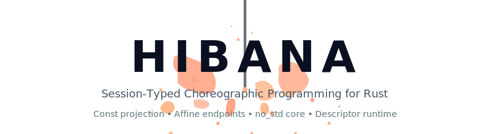

<div align="center">
  

  <p>
    
    
    
  </p>

  <p>
    <a href="#overview">Overview</a> •
    <a href="#quick-start">Quick Start</a> •
    <a href="#app-surface">App Surface</a> •
    <a href="#how-it-works">How It Works</a> •
    <a href="#protocol-integration">Protocol Integration</a> •
    <a href="#validation">Validation</a>
  </p>
</div>

# HIBANA

`hibana` is a Rust 2024 `#![no_std]` / `no_alloc` oriented affine MPST runtime.

It has two public surfaces:

- App surface: `hibana::g` plus `Endpoint`
- Substrate surface: `hibana::g::advanced` plus `hibana::substrate`

Application code should stay on `hibana::g` and `Endpoint`. Protocol crates
use `hibana::g::advanced` and `hibana::substrate` to attach transport,
binding, resolver, and policy.

Everything else is lower layer.

## Overview

`hibana` is for protocols that want one global choreography as the source of
truth and a small localside API at runtime.

The normal flow is:

1. Write one choreography with `hibana::g`
2. Let a protocol crate compose transport and appkit prefixes around it
3. Receive an attached `Endpoint`
4. Advance that endpoint with `flow().send()`, `recv()`, `offer()`, and `decode()`

What `hibana` gives you:

- typed projection from one global program
- compile-time checks for route shape, lane ownership, and composition errors
- fail-closed localside execution for label and payload mismatches
- a protocol-neutral core that does not bake QUIC, HTTP/3, or other wire terms
  into the crate root

## Cargo Features

- `std` - enables transport/testing utilities and observability normalisers.
  The runtime remains slab-backed and `no_alloc` oriented in both modes.

## Quick Start

Write a choreography once with `hibana::g`:

```rust
use hibana::g;

let request_response = g::seq(
    g::send::<g::Role<0>, g::Role<1>, g::Msg<1, u32>, 0>(),
    g::send::<g::Role<1>, g::Role<0>, g::Msg<2, u32>, 0>(),
);
```

After integration code returns an attached endpoint, app code stays on the
localside core API:

```rust
use hibana::g;

let _sent = endpoint.flow::<g::Msg<1, u32>>()?.send(&7).await?;
let reply = endpoint.recv::<g::Msg<2, u32>>().await?;
let _ = reply;
```

That is the intended app path: define a choreography, receive an endpoint, and
drive it with the localside methods.

## App Surface

App authors should stay on `hibana::g` and `Endpoint`.

| Job | Public owner |
| --- | --- |
| Define choreography | `hibana::g::{send, route, par, seq}` |
| Mark a dynamic policy point | `Program::policy::<POLICY_ID>()` |
| Send a known message | `flow().send()` |
| Receive a known message | `recv()` |
| Observe a route choice | `offer()` |
| Receive the first message of the chosen route arm | `decode()` |
| Inspect a chosen branch | `RouteBranch::{label, decode}` |

App code does not call projection, attach, binding, transport, or resolver
setup directly.

The public app language is fixed to:

- `hibana::g::{send, route, par, seq}`
- `Program::policy::<POLICY_ID>()`
- `RouteBranch::label()`
- `RouteBranch::decode()`
- `flow().send()`
- `offer()`
- `recv()`
- `decode()`

### Routes, Parallelism, and Dynamic Policy

`g::route(left, right)` is binary. `g::par(left, right)` is also binary and
requires disjoint `(role, lane)` ownership.

```rust
use hibana::g;

let left_arm = g::seq(
    g::send::<g::Role<0>, g::Role<0>, g::Msg<10, ()>, 0>().policy::<7>(),
    g::send::<g::Role<0>, g::Role<1>, g::Msg<11, [u8; 4]>, 0>(),
);
let right_arm = g::seq(
    g::send::<g::Role<0>, g::Role<0>, g::Msg<12, ()>, 0>().policy::<7>(),
    g::send::<g::Role<0>, g::Role<1>, g::Msg<13, u16>, 0>(),
);

let routed = g::route(left_arm, right_arm);

let parallel = g::par(
    g::send::<g::Role<0>, g::Role<1>, g::Msg<20, u32>, 1>(),
    g::send::<g::Role<0>, g::Role<1>, g::Msg<21, [u8; 8]>, 2>(),
);

let app = g::seq(routed, parallel);
```

Rules worth remembering:

- annotate only the control point that actually needs dynamic policy
- duplicate route labels are compile errors
- empty `g::par` arms are compile errors
- overlapping `(role, lane)` pairs in `g::par` are rejected
- dynamic route does not silently appear at runtime; it must be explicit in the
  choreography

### Driving an Endpoint

Each localside method has one job:

- `flow().send()` for sends you already know statically
- `recv()` for deterministic receives
- `offer()` when the next step is a route decision
- `decode()` when the chosen arm begins with a receive
- `drop(branch); endpoint.flow().send()` when the chosen arm begins with a send

```rust
use hibana::g;

let outbound = endpoint.flow::<g::Msg<1, u32>>()?.send(&7).await?;
let inbound = endpoint.recv::<g::Msg<2, u32>>().await?;

let mut branch = endpoint.offer().await?;
match branch.label() {
    30 => {
        let payload = branch.decode::<g::Msg<30, [u8; 4]>>().await?;
        let _ = (payload, outbound, inbound);
    }
    31 => {
        drop(branch);
        let () = endpoint.flow::<g::Msg<31, ()>>()?.send(&()).await?;
    }
    _ => unreachable!(),
}
```

### Result and Error Types

The app-facing owners at the crate root are:

- `hibana::SendResult<T>`
- `hibana::RecvResult<T>`
- `hibana::SendError`
- `hibana::RecvError`
- `hibana::RouteBranch`

### Compile-Time Guarantees

The public surface stays small because guarantees are pushed into the type
system:

- projection stays typed through `RoleProgram<'prog, ROLE, Mint>` and defaults
  to `RoleProgram<'prog, ROLE>`
- `g::route` rejects duplicate labels and controller mismatches before runtime
- `g::par` rejects empty fragments and role/lane overlap before runtime
- localside runtime is fail-closed for label and payload mismatches

## How It Works

`hibana` is choreography-first.

The connection shape is always:

```text
transport prefix -> appkit prefix -> user app
```

On the choreography side, that means:

```text
g::seq(transport prefix, g::seq(appkit prefix, APP))
```

The intended split is:

1. App code writes `APP: g::Program<_>`
2. A protocol crate composes transport and appkit prefixes around `APP`
3. The protocol crate projects a typed role witness with `project(&PROGRAM)`
4. The protocol crate attaches transport, binding, and policy, then returns
   the first app endpoint
5. App code continues only through the localside core API

This keeps the user-facing path small while preserving typed projection and a
protocol-neutral core.

### Driver and Branching

- The driver follows `offer()`; it does not invent decisions on its own
- Branch handling is just `match branch.label()`
- Use `branch.decode()` when the chosen arm begins with a receive
- Use `drop(branch); endpoint.flow().send()` when the chosen arm begins with a send
- `flow()` and `offer()` are preview-only; endpoint progress happens only when
  `send()` or `decode()` successfully consumes the preview
- App code and generic driver logic do not call transport APIs directly

### Route Authority

Route authority has exactly three public sources:

- `Ack` for already materialized canonical control decisions
- `Resolver` for dynamic-route resolution
- `Poll` for transport-observable static evidence

Important negative rule: hint labels and binding classifications are demux or
readiness evidence, not a fourth authority source.

Loop meaning comes from metadata, not from special wire labels. Labels are
representation; they are not semantic authority on their own.

### Lane and Binding Discipline

- `hibana` の app surface では、lane の意味は固定されません
- app lane ownership は protocol / appkit contract が決めます
- canonical な attach path では control traffic を lane `0` に載せます
- additional reserved lanes があるかどうかは transport / appkit 側の契約です
- bindings own demux and channel resolution, not route authority
- `hibana` runtime が app lane を推測したり吸収したりはしません
- unknown lanes are errors once the binding / transport contract is fixed

### Policy and Management Boundary

- `PolicySignalsProvider::signals(slot)` is the single public slot-input
  boundary
- EPF executes inside the resolver slot; it is not a second public policy API
- fail-closed is the default for verifier, trap, or fuel failures
- policy distribution and activation belong to the integration layer, not to
  endpoint-local helpers

### Responsibility Matrix

| Layer | Writes | Reads |
| --- | :---: | :---: |
| Transport | yes | yes |
| Resolver | no | yes |
| EPF | no | yes |
| Binder | no | yes |
| Driver | no | no |

## Public Surfaces

| Surface | Who uses it | Main owners |
| --- | --- | --- |
| App surface | application code | `hibana::g`, `Endpoint`, `RouteBranch`, `SendResult`, `RecvResult` |
| Substrate surface | protocol implementations | `hibana::g::advanced`, `hibana::substrate` |

If a concept is not owned by one of the two surfaces above, treat it as lower
layer rather than as part of the app-facing contract.

## Protocol Integration

Protocol implementations use the same choreography language as applications.
There is no second composition DSL.

```rust
use hibana::g;
use hibana::g::advanced::{RoleProgram, project};

const PROGRAM: g::Program<_> =
    g::seq(TRANSPORT_PREFIX, g::seq(APPKIT_PREFIX, APP));

let client: RoleProgram<'_, 0> = project(&PROGRAM);
```

### Substrate Surface

Protocol implementors use the protocol-neutral SPI:

- `hibana::g` owns choreography composition
- `hibana::g::advanced` owns typed projection and compile-time control-message
  typing
- `hibana::substrate` owns attach, enter, binding, resolver, policy, and
  transport seams
- the root app surface does not expose `SessionKit`, `BindingSlot`,
  `RoleProgram`, or typestate internals

The everyday protocol-side owners are:

- `hibana::g::advanced::{project, RoleProgram, CanonicalControl, ExternalControl, MessageSpec, ControlMessage, ControlMessageKind}`
- `hibana::substrate::SessionKit`
- `hibana::substrate::{AttachError, CpError, EffIndex, Lane, RendezvousId, SessionId}`
- `hibana::substrate::Transport`
- `hibana::substrate::binding::{BindingSlot, NoBinding}`
- `hibana::substrate::policy::{ContextId, ContextValue, DynamicResolution, PolicyAttrs, PolicySignals, PolicySignalsProvider, ResolverContext, ResolverError, ResolverRef, PolicySlot}`
- `hibana::substrate::runtime::{Clock, Config, CounterClock, DefaultLabelUniverse, LabelUniverse}`
- `hibana::substrate::tap::TapEvent`
- `hibana::substrate::cap::{CapShot, ControlResourceKind, GenericCapToken, Many, One, ResourceKind}`
- `hibana::substrate::wire::{Payload, WireEncode, WirePayload}`
- `hibana::substrate::transport::{Outgoing, TransportError, TransportEvent, TransportEventKind, TransportSnapshot}`

Advanced buckets:

- `hibana::substrate::policy::core::*` for fixed context-key ids
- `hibana::substrate::cap::advanced` for mint details and the built-in
  control-kind catalogue
- `hibana::substrate::transport` detail owners for send direction, algorithm
  reporting, and metrics translation

Everything in this section is protocol-neutral. If a concept is protocol
specific, keep it outside `hibana`'s public surface.

### Control Messages

There is no public `g::splice`, `g::delegate`, or `g::reroute`.

`delegate`, `splice`, `reroute`, `route`, `loop`, and management-policy
operations are all expressed as ordinary `g::send()` steps whose message type
carries a capability token and a control-handling marker.

The key owners are:

- `CanonicalControl<K>` for locally minted control tokens
- `ExternalControl<K>` for control tokens carried on the wire
- `MessageSpec` for label, payload, and control typing
- `ControlMessage` and `ControlMessageKind` for control-message-only contracts

Handling rules are fixed:

- `CanonicalControl<K>` is compile-time restricted to self-send
- `ExternalControl<K>` may cross roles and ride the wire
- the operation itself comes from the control kind's resource tag, not from a
  second DSL

The built-in control kind catalogue lives under
`hibana::substrate::cap::advanced`:

- route and loop: `RouteDecisionKind`, `LoopContinueKind`, `LoopBreakKind`
- checkpoint and recovery: `CheckpointKind`, `CommitKind`, `RollbackKind`,
  `CancelKind`, `CancelAckKind`
- splice and reroute: `SpliceIntentKind`, `SpliceAckKind`, `RerouteKind`
- policy lifecycle: `PolicyLoadKind`, `PolicyActivateKind`, `PolicyRevertKind`,
  `PolicyAnnotateKind`
- management load protocol: `LoadBeginKind`, `LoadCommitKind`

If a protocol needs a custom control kind, implement the capability traits in
`hibana::substrate::cap::advanced` and carry that kind through
`GenericCapToken<K>` plus `CanonicalControl<K>` or `ExternalControl<K>`.

Control kinds are still just message types in the choreography:

```rust
use hibana::g;
use hibana::g::advanced::{CanonicalControl, ExternalControl};
use hibana::substrate::cap::{ControlResourceKind, GenericCapToken};
use hibana::substrate::cap::advanced::{
    LoopContinueKind, SpliceIntentKind,
};

let loop_continue = g::send::<
    g::Role<0>,
    g::Role<0>,
    g::Msg<
        { <LoopContinueKind as ControlResourceKind>::LABEL },
        GenericCapToken<LoopContinueKind>,
        CanonicalControl<LoopContinueKind>,
    >,
    0,
>();

let splice_intent = g::send::<
    g::Role<0>,
    g::Role<1>,
    g::Msg<
        { <SpliceIntentKind as ControlResourceKind>::LABEL },
        GenericCapToken<SpliceIntentKind>,
        ExternalControl<SpliceIntentKind>,
    >,
    0,
>();
```

Capability-building owners live in two layers:

- `hibana::substrate::cap::{One, Many}` for affine shot discipline
- `hibana::substrate::cap::{CapShot, ResourceKind, ControlResourceKind}` for
  runtime capability representation
- `hibana::substrate::cap::advanced::{MintConfig, MintConfigMarker,
  ControlMint, SessionScopedKind, AllowsCanonical, EpochTbl, CAP_HANDLE_LEN,
  CapError, CapsMask}` for mint configuration
- `hibana::substrate::cap::advanced::{ControlScopeKind, ScopeId,
  ControlHandling}` for control-scope metadata

### Transport

`hibana::substrate::Transport` is the protocol-neutral I/O seam. It owns send,
recv, requeue, event draining, hint exposure, metrics, and pacing updates.
`Send` and `Recv` future types must be `Unpin`.

```rust
struct MyTransport;

impl hibana::substrate::Transport for MyTransport {
    type Error = hibana::substrate::transport::TransportError;
    type Tx<'a> = () where Self: 'a;
    type Rx<'a> = () where Self: 'a;
    type Send<'a> = core::future::Ready<Result<(), Self::Error>> where Self: 'a;
    type Recv<'a> =
        core::future::Ready<Result<hibana::substrate::wire::Payload<'a>, Self::Error>>
    where
        Self: 'a;
    type Metrics = ();

    fn open<'a>(&'a self, _local_role: u8, _session_id: u32) -> (Self::Tx<'a>, Self::Rx<'a>) {
        ((), ())
    }

    fn send<'a, 'f>(
        &'a self,
        _tx: &'a mut Self::Tx<'a>,
        _outgoing: hibana::substrate::transport::Outgoing<'f>,
    ) -> Self::Send<'a>
    where
        'a: 'f,
    {
        core::future::ready(Ok(()))
    }

    fn recv<'a>(&'a self, _rx: &'a mut Self::Rx<'a>) -> Self::Recv<'a> {
        static EMPTY: [u8; 0] = [];
        core::future::ready(Ok(hibana::substrate::wire::Payload::new(&EMPTY)))
    }

    fn requeue<'a>(&'a self, _rx: &'a mut Self::Rx<'a>) {}

    fn drain_events(
        &self,
        emit: &mut dyn FnMut(hibana::substrate::transport::TransportEvent),
    ) {
        emit(hibana::substrate::transport::TransportEvent::new(
            hibana::substrate::transport::TransportEventKind::Ack,
            10,
            1200,
            0,
        ));
    }

    fn recv_label_hint<'a>(&'a self, _rx: &'a Self::Rx<'a>) -> Option<u8> {
        None
    }

    fn metrics(&self) -> Self::Metrics {
        ()
    }

    fn apply_pacing_update(&self, _interval_us: u32, _burst_bytes: u16) {}
}
```

Transport rules:

- `recv()` must yield borrowed payload views
- `recv()` and `decode()` return the decoded view chosen by the payload owner
- `requeue()` is how transport hands an unconsumed frame back
- `drain_events()` feeds protocol-neutral transport observation
- `recv_label_hint()` is a demux hint, not route authority
- `metrics()` returns `TransportSnapshot` through `TransportMetrics`

### SessionKit and Endpoint Attachment

`hibana::substrate::SessionKit::new(&clock)` is the canonical starting point.
The borrowed, `no_alloc`-oriented path is the canonical substrate path: keep
the clock, config storage, projected program, and resolver state borrowed; add
rendezvous once; then `enter()`.

```rust
let mut tap_buf = [hibana::substrate::tap::TapEvent::zero(); 128];
let mut slab = [0u8; 64 * 1024];
let clock = hibana::substrate::runtime::CounterClock::new();
let config = hibana::substrate::runtime::Config::new(&mut tap_buf, &mut slab);

let cluster: hibana::substrate::SessionKit<
    '_,
    MyTransport,
    hibana::substrate::runtime::DefaultLabelUniverse,
    hibana::substrate::runtime::CounterClock,
    4,
> = hibana::substrate::SessionKit::new(&clock);

let transport = MyTransport;
let rv_id = cluster.add_rendezvous_from_config(config, transport)?;

let endpoint = cluster.enter(
    rv_id,
    hibana::substrate::SessionId::new(1),
    &CLIENT,
    hibana::substrate::binding::NoBinding,
)?;
```

Key points:

- the borrowed path is canonical even under `std`
- storage stays slab-backed, not heap-backed
- the same borrowed `RoleProgram` can be passed to `set_resolver()` and
  `enter()`
- `Config::new(tap_buf, slab)` allocates tap storage and the rendezvous slab
- `Config::with_lane_range(range)` reserves lane space for the transport/appkit
  split
- `Config::with_universe(universe)` and `Config::with_clock(clock)` install
  custom label-universe and clock owners
- bootstrap failures use `hibana::substrate::CpError` and
  `hibana::substrate::AttachError`

### BindingSlot

`BindingSlot` is the transport-adapter seam for framed streams, multiplexed
channels, and slot-scoped policy signals. It is also where protocol code
supplies `PolicySignalsProvider`.

`BindingSlot` is demux and transport observation only. It does not decide route
arms.

```rust
struct MyBinding {
    signals: hibana::substrate::policy::PolicySignals,
}

impl hibana::substrate::policy::PolicySignalsProvider for MyBinding {
    fn signals(
        &self,
        _slot: hibana::substrate::policy::PolicySlot,
    ) -> hibana::substrate::policy::PolicySignals {
        self.signals
    }
}

impl hibana::substrate::binding::BindingSlot for MyBinding {
    fn poll_incoming_for_lane(
        &mut self,
        _logical_lane: u8,
    ) -> Option<hibana::substrate::binding::IncomingClassification> {
        Some(hibana::substrate::binding::IncomingClassification {
            label: 40,
            instance: 0,
            has_fin: false,
            channel: hibana::substrate::binding::Channel::new(7),
        })
    }

    fn on_recv<'a>(
        &'a mut self,
        _channel: hibana::substrate::binding::Channel,
        scratch: &'a mut [u8],
    ) -> Result<
        hibana::substrate::wire::Payload<'a>,
        hibana::substrate::binding::TransportOpsError,
    > {
        scratch[..4].copy_from_slice(&[1, 2, 3, 4]);
        Ok(hibana::substrate::wire::Payload::new(&scratch[..4]))
    }

    fn policy_signals_provider(
        &self,
    ) -> Option<&dyn hibana::substrate::policy::PolicySignalsProvider> {
        Some(self)
    }
}
```

Binding rules:

- `poll_incoming_for_lane()` is lane-local demux only
- `on_recv()` reads from the already selected channel and returns a borrowed
  payload view
- `policy_signals_provider()` is the only public input source for slot-scoped
  signals

Supporting binding owners:

- `Channel`, `ChannelDirection`, and `ChannelKey` identify stream and channel
  endpoints
- `ChannelStore` is the storage contract when the binding owns multiple
  channels
- `TransportOpsError` is the canonical binding-side I/O error

### Policy

Dynamic policy stays explicit:

- annotate the choreography with `Program::policy::<POLICY_ID>()`
- register a resolver with `set_resolver::<POLICY_ID, ROLE, _>(...)`
- read inputs through `ResolverContext::input(index)` and attrs through
  `ResolverContext::attr(id)`
- return `Result<DynamicResolution, ResolverError>`

`ResolverContext` is intentionally small: `input(index)` and `attr(id)` are the
only public accessors.

The public policy-owner surface is intentionally narrow:

- `hibana::substrate::policy::PolicySlot` owns the generic slot identity
- an external policy engine may execute inside the same resolver slot, but that
  engine is not part of the `hibana` crate surface
- policy execution is fail-closed; verifier, trap, and fuel failures reject
  rather than falling through

Useful policy owners and helpers:

- `ContextId` and `ContextValue` for fixed-width policy inputs and attrs
- `PolicyAttrs` for the attribute bag copied into resolver context
- `PolicySignals` for slot-scoped inputs delivered by
  `PolicySignalsProvider`
- `ResolverRef::from_state()` for borrowed-state resolvers
- `ResolverRef::from_fn()` for stateless callbacks
- `hibana::substrate::policy::core::*` for fixed metadata such as `RV_ID`,
  `SESSION_ID`, `LANE`, `QUEUE_DEPTH`, `SRTT_US`, `PTO_COUNT`,
  `IN_FLIGHT_BYTES`, and `TRANSPORT_ALGORITHM`

Example resolver:

```rust
const POLICY_ID: u16 = 7;

struct RoutePolicy {
    preferred_arm: u8,
}

fn route_resolver(
    policy: &RoutePolicy,
    ctx: hibana::substrate::policy::ResolverContext,
) -> Result<hibana::substrate::policy::DynamicResolution, hibana::substrate::policy::ResolverError>
{
    if ctx.input(0) != 0 {
        return Ok(hibana::substrate::policy::DynamicResolution::RouteArm {
            arm: policy.preferred_arm,
        });
    }

    if ctx
        .attr(hibana::substrate::policy::core::QUEUE_DEPTH)
        .is_some_and(|value| value.as_u32() > 128)
    {
        return Err(hibana::substrate::policy::ResolverError::Reject);
    }

    Ok(hibana::substrate::policy::DynamicResolution::Defer { retry_hint: 1 })
}

let route_policy = RoutePolicy { preferred_arm: 1 };

cluster.set_resolver::<POLICY_ID, 0, _>(
    rv_id,
    &CLIENT,
    hibana::substrate::policy::ResolverRef::from_state(&route_policy, route_resolver),
)?;
```

### Wire and Transport Observation

`hibana::substrate::wire::{Payload, WireEncode, WirePayload}` is the canonical
payload seam.

`hibana::substrate::transport::{TransportEvent, TransportEventKind,
TransportSnapshot}` is the canonical transport-observation seam.

If a payload type crosses the wire and is not already a codec type, implement
`WireEncode` plus `WirePayload`. Borrowed payload views use
`type Decoded<'a> = ...`; fixed-width by-value payloads stay on the same
contract with `type Decoded<'a> = Self`.

Transport telemetry is surfaced two ways:

- resolvers read snapshot data through `ResolverContext::attr()` and
  `hibana::substrate::policy::core::*`
- transports emit semantic events through `TransportEvent` and
  `TransportEventKind`
- codec failures report through `CodecError`
- transport failures report through `TransportError`
- `TransportMetrics` turns implementation-specific counters into
  `TransportSnapshot`

Example snapshot construction:

```rust
let snapshot = hibana::substrate::transport::TransportSnapshot::new(Some(500), Some(2))
    .with_retransmissions(Some(1))
    .with_congestion_window(Some(65_536))
    .with_in_flight(Some(4096))
    .with_algorithm(Some(hibana::substrate::transport::TransportAlgorithm::Cubic));

let transport_event = hibana::substrate::transport::TransportEvent::new(
    hibana::substrate::transport::TransportEventKind::Ack,
    42,
    1200,
    0,
);

let _ = (snapshot.queue_depth, transport_event.packet_number);
```

`TransportSnapshot` uses builder-style enrichment:

- `TransportSnapshot::new(latency_us, queue_depth)`
- `with_congestion_marks`, `with_pacing_interval`, `with_retransmissions`
- `with_pto_count`, `with_srtt`, `with_latest_ack`
- `with_congestion_window`, `with_in_flight`, `with_algorithm`

### Management Boundary

`hibana` does not define a built-in management protocol.

If an integration needs policy distribution, tap streaming, or any other
cluster-management session, that choreography lives outside the `hibana` crate.
`hibana` only provides the neutral seams needed to compose, project, attach,
and drive that choreography.

Management-style usage still follows the normal substrate path:

```rust
use hibana::g;
use hibana::g::advanced::project;

const PROGRAM: g::Program<_> =
    g::seq(MGMT_PREFIX, APP);

let controller_program = project(&PROGRAM);
let cluster_program = project(&PROGRAM);

let controller = cluster.enter(
    rv_id,
    sid,
    &controller_program,
    hibana::substrate::binding::NoBinding,
)?;
let cluster_role = cluster.enter(
    rv_id,
    sid,
    &cluster_program,
    hibana::substrate::binding::NoBinding,
)?;

let _ = (controller, cluster_role);
```

## Validation

The canonical local validation flow is:

```bash
bash ./.github/scripts/check_policy_surface_hygiene.sh
bash ./.github/scripts/check_surface_hygiene.sh
bash ./.github/scripts/check_boundary_contracts.sh
bash ./.github/scripts/check_plane_boundaries.sh
bash ./.github/scripts/check_mgmt_boundary.sh
bash ./.github/scripts/check_resolver_context_surface.sh
bash ./.github/scripts/check_warning_free.sh
bash ./.github/scripts/check_direct_projection_binary.sh
bash ./.github/scripts/check_no_std_build.sh

cargo check --all-targets -p hibana
cargo check --no-default-features --lib -p hibana

cargo test -p hibana --features std
cargo test -p hibana --test ui --features std
cargo test -p hibana --test policy_replay --features std
cargo test -p hibana --test public_surface_guards --features std
cargo test -p hibana --test substrate_surface --features std
cargo test -p hibana --test docs_surface --features std
```

These checks keep the public surface small, keep `no_std` healthy, and guard
the compile-time guarantees described above.

Before pushing, also verify these invariants:

- `hibana/src/**/*.rs` stays protocol-neutral
- route authority stays `Ack | Resolver | Poll`
- static unprojectable route stays compile-error, not runtime rescue
- typed projection stays intact
- substrate names do not leak back into the app surface
